#LEMP STACK IMPLEMENTATION

**STEP 1: Install NGINX WEB SERVER**

* Update package 

`sudo apt update`

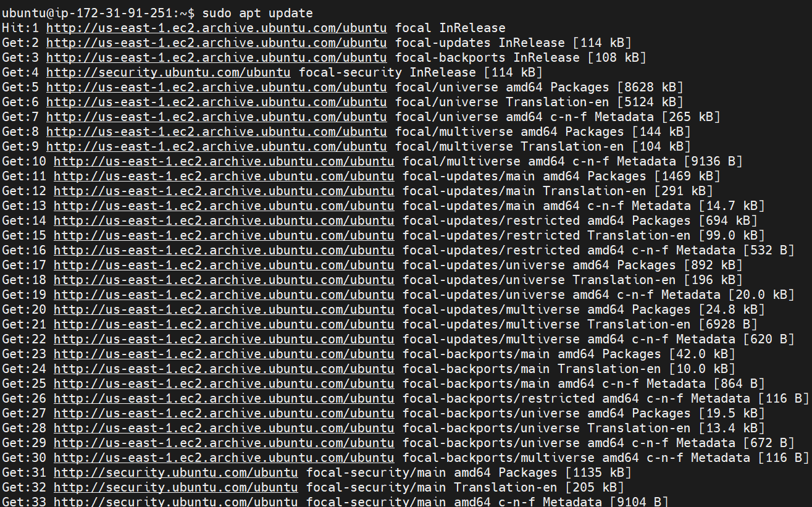

* Install NGINX 

`sudo apt install nginx`

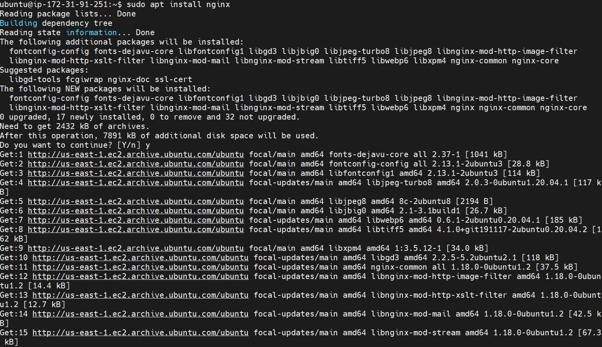

* Verify NGINX installation*

`sudo systemctl status nginx`

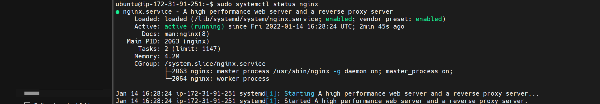

* Add a rule to EC2 configuration to open inbound connection through port 80

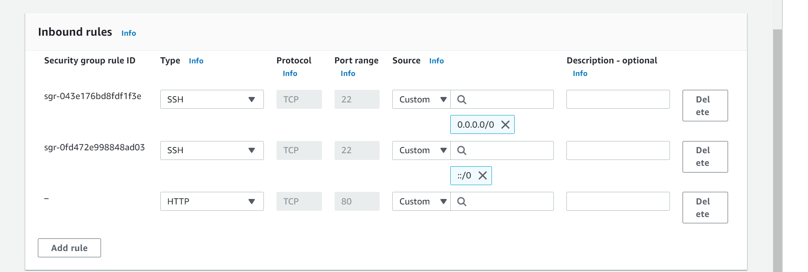

* Access server locally from ubuntu

`curl http://localhost:80`

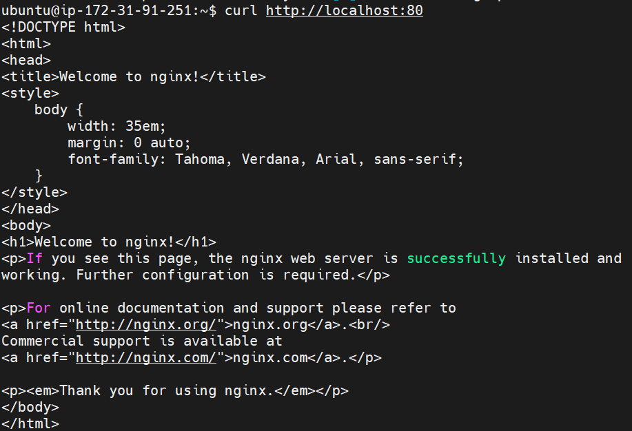

* Access NGINX web server via web browser

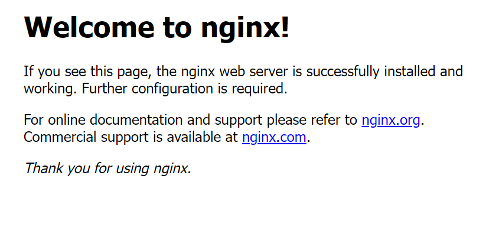

**STEP 2: MYSQL INSTALLATION**

* acquire and install MYSQL 

`sudo apt install mysql-server`

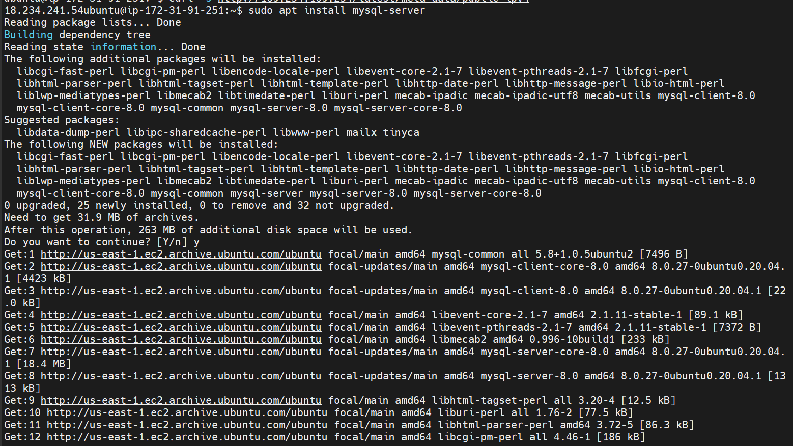

* Run secure script

`sudo mysql_secure_installation`

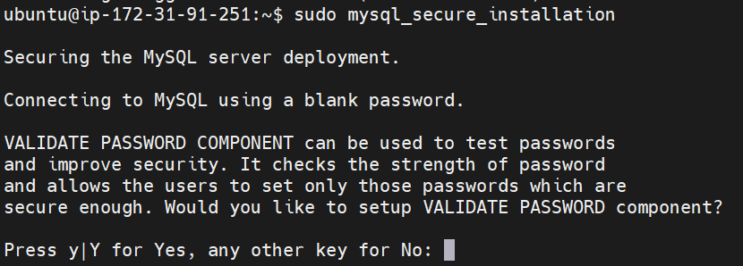

* Test MYSQL

`sudo mysql`

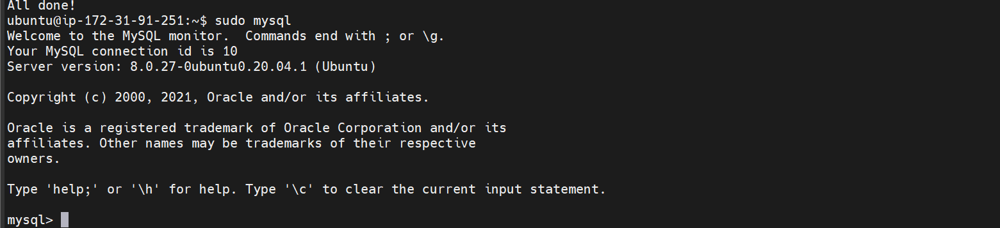

**STEP 3: PHP INSTALLATION**

1. Install PHP packages

`sudo apt install php libapache2-mod-php php-mysql`

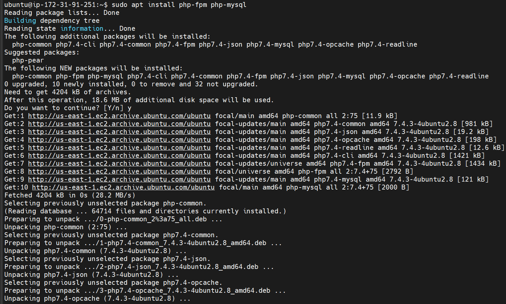

**STEP 4: CONFIGURING NGINX TO USE PHP PROCESSOR**

* Create the root web directory for projectLEMP

`sudo mkdir /var/www/projectLEMP`

* Assign ownership of the directory with the $USER environment variable

`sudo chown -R $USER:$USER /var/www/projectLEMP`

* open a new configuration file in Nginx’s sites-available directory

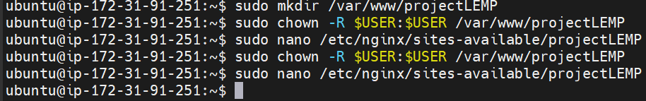

* add and save the below configuration 

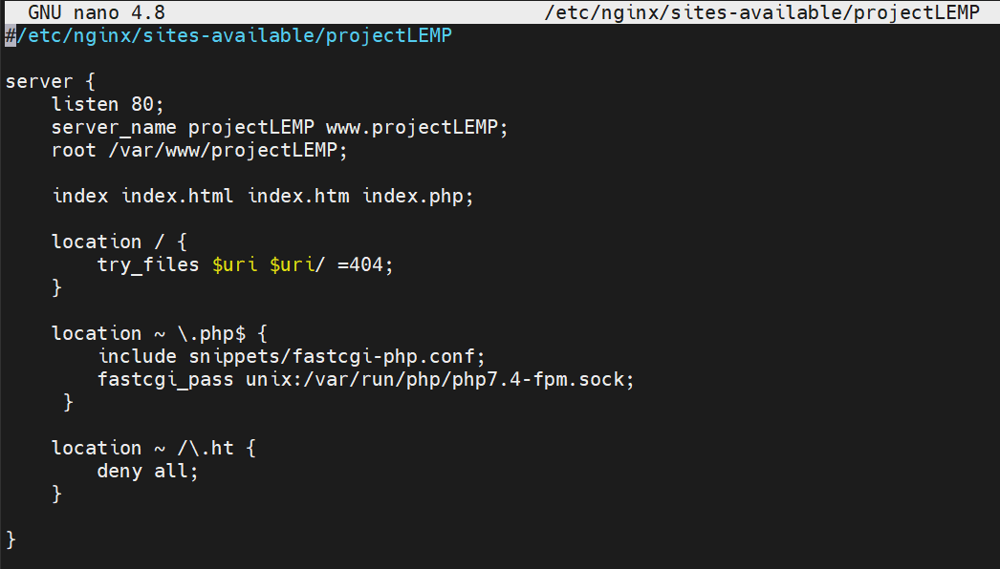

* Activate your configuration by linking to the config file from Nginx’s sites-enabled directory
 
`sudo ln -s /etc/nginx/sites-available/projectLEMP /etc/nginx/sites-enabled/`

* Test for syntax errors 

`sudo nginx -t`

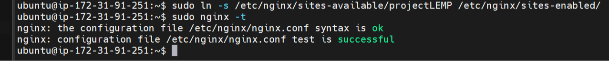

* Disable default NGINX host

`sudo unlink /etc/nginx/sites-enabled/default`

* Reload NGINX

`sudo systemctl reload NGINX`

Website is active

* Create an index.html file in web root

`sudo echo 'Hello LEMP from hostname' $(curl -s http://169.254.169.254/latest/meta-data/public-hostname) 'with public IP' $(curl -s http://169.254.169.254/latest/meta-data/public-ipv4) > /var/www/projectLEMP/index.html`

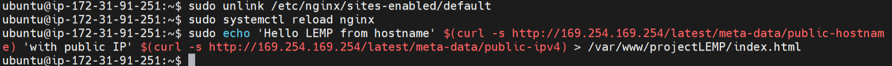

* Open site in browser using IP address

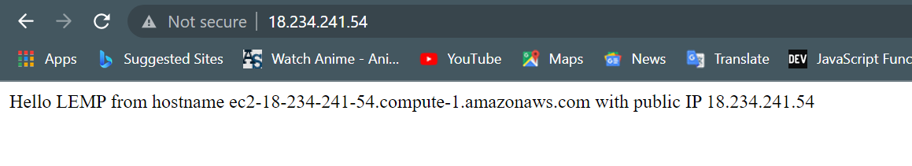

## LEMP STACK fully configured

**STEP 5: Test PHP with NGINX**

* Create a PHP file in document root

`sudo nano /var/www/projectLEMP/info.php`

* Input and save the lines below into the new file

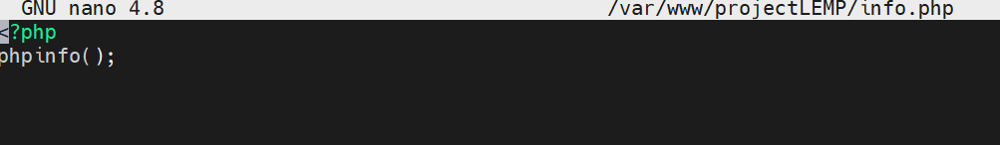

* Access PHP page via web browser
(http://18.234.241.54/todo_list.php)

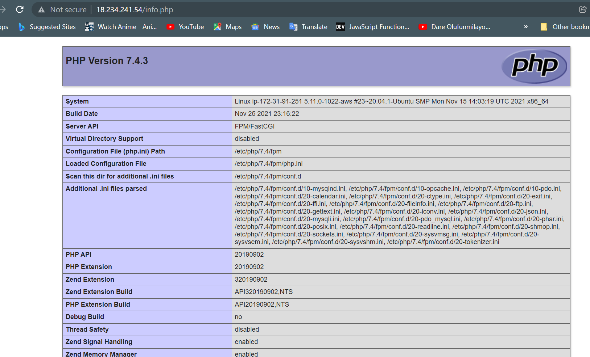

* Remove PHP file 

`sudo rm /var/www/your_domain/info.php`

**STEP 6: RETRIEVING DATA FROM MYSQL DATABASE WITH PHP

* Connect to MYSQL using root account

`sudo mysql`

* Create a database

`mysql> CREATE DATABASE `example_database`;`

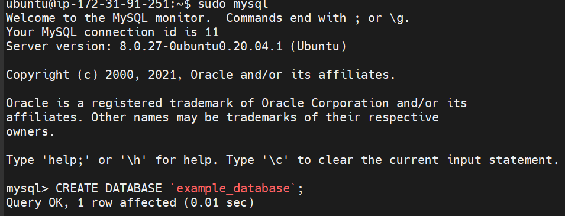

* Create a new user

`mysql>  CREATE USER 'example_user'@'%' IDENTIFIED WITH mysql_native_password BY 'password';`

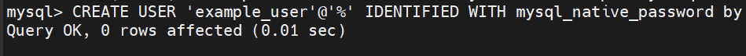

* Grant user permissions over database

`mysql> GRANT ALL ON example_database.* TO 'example_user'@'%';`

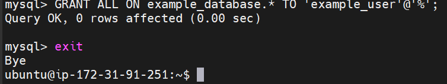

* Test if user has proper permissions 

`mysql -u example_user -p`

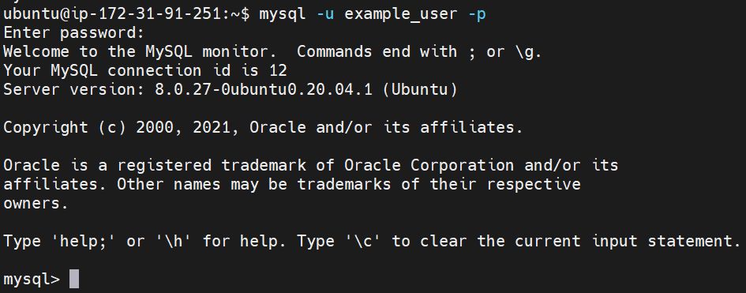

* Confirm user access 

`mysql> SHOW DATABASES;`

* Creating a table in MYSQL console 
`mysql> CREATE TABLE example_database.todo_list( info );`

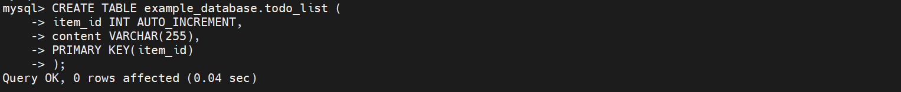

* Inserting rows

`mysql> INSERT INTO example_database.todo_list (content) VALUES ("My first important item");`

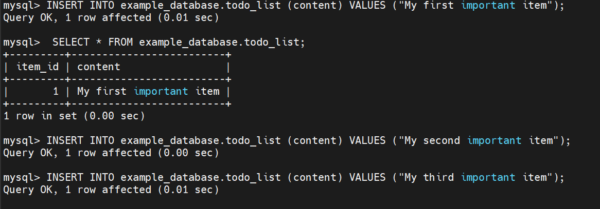

`mysql> INSERT INTO example_database.todo_list (content) VALUES ("My second important item")`

`mysql> INSERT INTO example_database.todo_list (content) VALUES ("My third important item")`

`mysql> INSERT INTO example_database.todo_list (content) VALUES ("My fourth important item")`

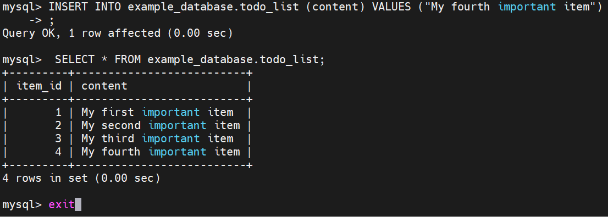

*create a PHP script that will connect to MySQL and query for your content

`nano /var/www/projectLEMP/todo_list.php`

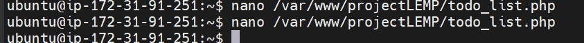

* input the lines below and save 

> 
*<?php*

$user = "example_user";

$password = "password";

$database = "example_database";

$table = "todo_list";"

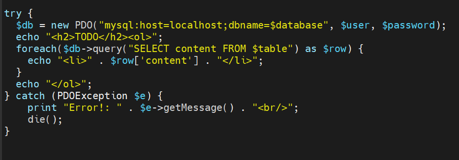

* Access page via web browser
(http://18.234.241.54/todo_list.php)

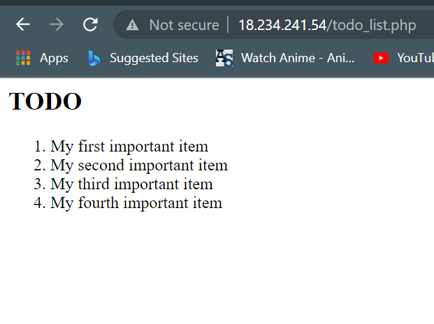

